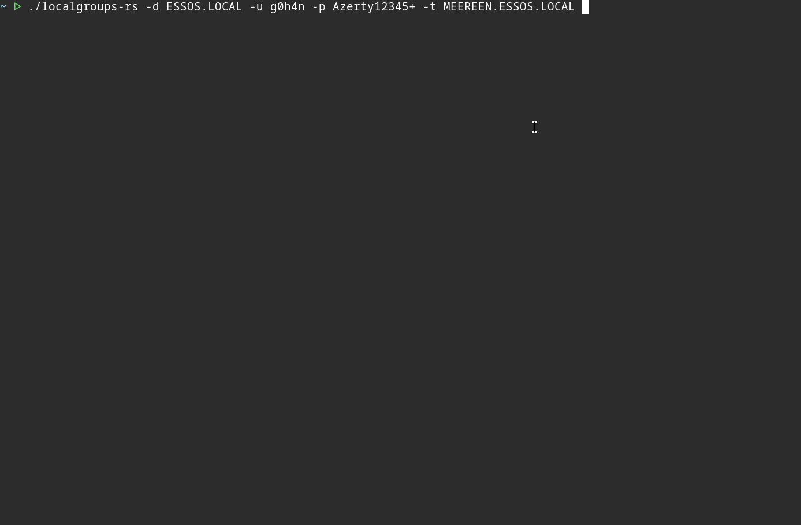

<p align="center">
    <b>LocalGroups-rs</b>
</p>

<p align="center">
    
    
    
    
    <a href="https://github.com/g0h4n/RustHound-CE/issues/69"></a>
</p>

<hr />

**LocalGroups-rs** enumerates Windows **local group membership** over MS-SAMR and turns it into BloodHound-shaped `LocalGroups` data: the `AdminTo`, `CanRDP`, `ExecuteDCOM` and `CanPSRemote` edges. It opens the BUILTIN aliases on each target (`SamrOpenAlias` / `SamrGetMembersInAlias`) and reports their members as SIDs, filtering out the accounts that live only in the target's own SAM.

It was built to prototype the `Computer`:`LocalGroups` line of the [RustHound-CE roadmap](https://github.com/g0h4n/RustHound-CE/blob/main/ROADMAP.md), tracked as [RustHound-CE#69](https://github.com/g0h4n/RustHound-CE/issues/69), the last live-collection field SharpHound fills and RustHound-CE does not. It is pure Rust on [icedracon](https://github.com/icedracon)'s DCE/RPC stack (`dcerpc` + `smb2-client`), the same one behind [HasSession-rs](https://github.com/g0h4n/HasSession-rs), and its `src/transport/` folder is copied unchanged from RustHound-CE so the eventual port is a move rather than a rewrite.

- [HELP.md](HELP.md) - How to compile it? How to use it? All options with examples.
- [CHANGELOG.md](CHANGELOG.md) - A record of all significant version changes
- [ROADMAP.md](ROADMAP.md) - Implemented collection and planned evolutions.

Upstream tracking issue: [RustHound-CE#69 \[Feature Request\] LocalGroups](https://github.com/g0h4n/RustHound-CE/issues/69)

# Quick usage

## Compilation

```bash
# Build a release binary
cargo build --release
# Binary: ./target/release/localgroups-rs
```

## Installation

```bash
# Install and/or update localgroups-rs from cargo command
cargo install localgroups-rs
```

## Usage

```bash
# Every alias, one host, password bind
./localgroups-rs -d ESSOS -u daenerys.targaryen -p 'BurnThemAll!' -t MEEREEN.ESSOS.LOCAL

# Local admins only, wide sweep, pass-the-hash
echo 'MEEREEN.ESSOS.LOCAL' > hosts.txt
echo 'BRAAVOS.ESSOS.LOCAL' >> hosts.txt
./localgroups-rs -d ESSOS -u daenerys.targaryen -H :34534854d33b398b66684072224bb47a -T hosts.txt -c AdminOnly

# Kerberos pass-the-ticket from a ccache
export KRB5CCNAME=/tmp/daenerys.targaryen.ccache
./localgroups-rs -d ESSOS -u daenerys.targaryen -k -t MEEREEN.ESSOS.LOCAL

# Who is admin where?
./localgroups-rs -d ESSOS -u daenerys.targaryen -p 'BurnThemAll!' -T hosts.txt -q --json | jq '.by_principal'
```

Three authentication paths are supported, exactly as in RustHound-CE: **NTLMv2 bind** (`-p`), **pass-the-hash** (`-H`), and **Kerberos pass-the-ticket** (`-k`, TGT read from `KRB5CCNAME`). More examples and the full option list are on the [help page](HELP.md).

## Demo

<p align="center">
    <picture>
        
    </picture>
</p>

# Collection

| RID | BUILTIN group | BloodHound edge | Typical privilege needed |
|---|---|---|---|
| 544 | Administrators | `AdminTo` | local admin on a member host; any domain user on a DC |
| 555 | Remote Desktop Users | `CanRDP` | same |
| 562 | Distributed COM Users | `ExecuteDCOM` | same |
| 580 | Remote Management Users | `CanPSRemote` | same; absent on some older or Core builds |

Select a subset with `-c AdminOnly` / `RdpOnly` / `DcomOnly` / `PSRemoteOnly`. `All` is the default.

Everything is read-only: `SamrOpenAlias` is requested with `ALIAS_LIST_MEMBERS` and nothing else, and no write opnum is compiled in.

# Output

`computers[].LOCALGroups[]` is serialized in exactly the shape RustHound-CE's `objects::common::LocalGroup` expects, so the port is a straight field map:

```json
{
  "ObjectIdentifier": "S-1-5-21-1111111111-2222222222-3333333333-544",
  "Results": [
    { "ObjectIdentifier": "S-1-5-21-...-512", "ObjectType": "Base" }
  ],
  "LocalNames": [],
  "Collected": true,
  "FailureReason": null
}
```

`edges[]` and `by_principal` are the operator-facing views: what HasSession-rs does for sessions, this does for local group membership.

# Credits

Built on [icedracon](https://github.com/icedracon)'s pure-Rust stack: [`dcerpc`](https://github.com/icedracon/dcerpc), [`smb2-client`](https://github.com/icedracon/smb2-client), `ms-ndr` and `windows-sddl`. The SMB2/SAMR pipeline follows [adhammer](https://github.com/icedracon/adhammer)'s `enum samr`; the alias branch (opnums 27 and 33) is added here. The Kerberos and GSS helpers in `src/transport/` are RustHound-CE's, themselves ported from adhammer. The alias-to-edge mapping and the local-member filtering rule come from SharpHound's [`LocalGroupProcessor.cs`](https://github.com/SpecterOps/SharpHoundCommon/blob/v4.8.0/src/CommonLib/Processors/LocalGroupProcessor.cs).
